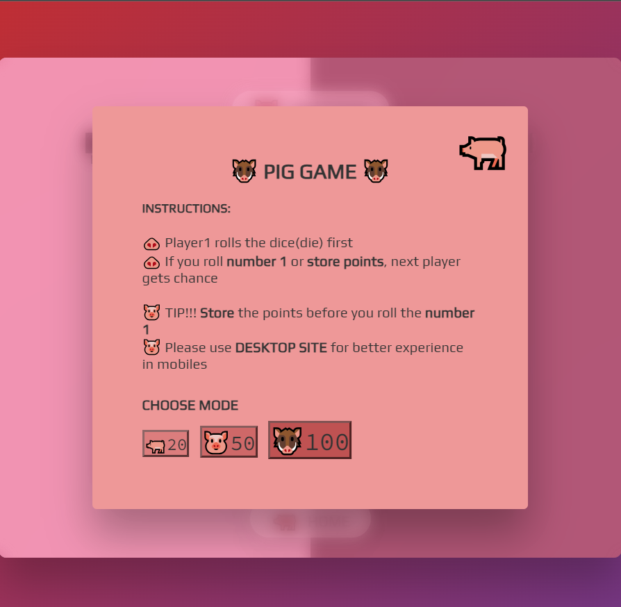
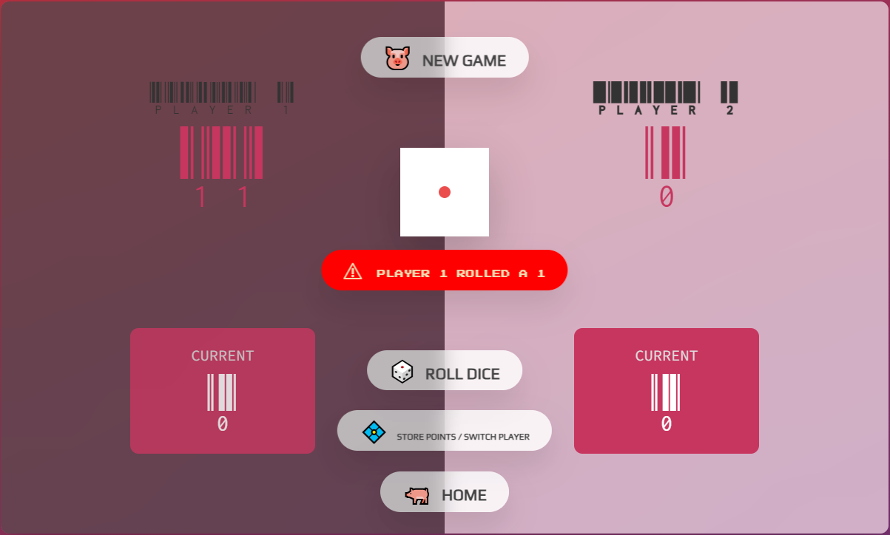
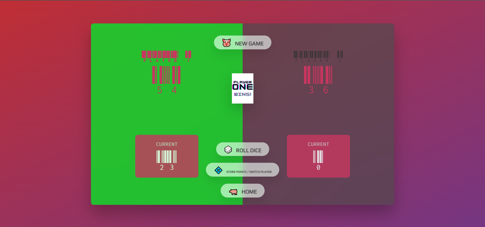

# Pig Dice Game

Pig is a classic dice game that has been enjoyed for decades. The game's objective is to score the most points by rolling a six-sided die. It's a game of chance and strategy that can be played with any number of players.

## Game Rules

- Each player takes turns to roll a six-sided die.
- On a player's turn, they can roll the die as many times as they like and accumulate points from each roll.
- If a player rolls a 1, they lose all their accumulated points for that turn, and their turn ends.
- The player can choose to "hold" at any time during their turn, adding their accumulated points to their total score.
- The first player to reach the target score (20, 50, or 100, depending on the chosen mode) or more wins the game.

## Game Modes

Pig Dice Game offers three modes with different target scores:

- **Mode 20**: The target score is 20 points. It's a quick and simple mode, ideal for short games.
- **Mode 50**: The target score is 50 points. This mode provides a balanced gameplay experience for medium-length games.
- **Mode 100**: The target score is 100 points. It offers a longer and more challenging game for those seeking a test of endurance.

## Technologies Used

The Pig Dice Game is implemented using the following technologies:

- JavaScript: The core game logic and interactivity are built using JavaScript, a versatile programming language for web development.

- HTML: The game's user interface and structure are created using HTML (Hypertext Markup Language), the standard markup language for web pages.

- CSS: CSS (Cascading Style Sheets) is used to style and layout the game's HTML elements, ensuring an appealing and user-friendly design.

## How to Play

1. Open the game in your web browser.
2. Select one of the three game modes: Mode 20, Mode 50, or Mode 100.
3. Click on the "Roll Dice" button to roll the die and accumulate points for your turn.
4. Keep rolling the die until you decide to "Hold" and add your accumulated points to your total score.
5. Be cautious of rolling a 1, as it will reset your accumulated points for that turn.
6. The first player to reach or exceed the target score wins the game.

## Play the Game

You can play the Pig Dice Game online by visiting the following link: https://sevana.com/paul/pig_game/

## Development

This game is a simple implementation of the Pig Dice Game. Contributions and improvements are welcome! If you find any issues or have ideas for enhancements, feel free to open an issue or submit a pull request.

## License

The Pig Dice Game is released under the [MIT License](https://opensource.org/licenses/MIT).

---

**Note:** Customize this README.md file further with additional information, such as credits for any assets used, future features, and any other relevant details about the game.
